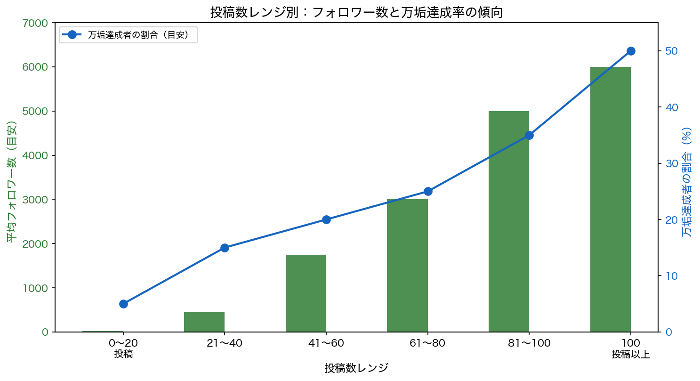

# 投稿数レンジ別：フォロワー数と万垢達成率の傾向

提供されたデータに基づき、「投稿数」と「フォロワー数（成果）」の相関関係を整理しました。データ全体から読み取れる明確な傾向として、**「投稿数が増えるほど、万垢（フォロワー1万人以上）達成率が飛躍的に高まる」**という事実が浮かび上がっています。一方で、投稿数が少ない段階での離脱や伸び悩みも多く見られます。

---

## 投稿数レンジ別の概要（一覧）

| 投稿数レンジ | 平均フォロワー数（未達成者目安） | 万垢達成者の割合（目安） | 状況の概要 |
|--------------|----------------------------------|---------------------------|------------|
| **0〜20投稿** | 0〜50人 | 極めて低い（約5%） | **【試練の時期】** 大半が準備中や初期段階で停止。稀に1発バズで伸びる「運」の要素が強い層も存在。 |
| **21〜40投稿** | 100〜800人 | 低い（約15%） | **【継続の壁】** 少しずつ伸び始めるが成果が見えにくく最も苦しい時期。ここで辞める人が多い。 |
| **41〜60投稿** | 500〜3,000人 | 中程度（約20%） | **【成長の兆し】** 「プチバズ」が出始め、フォロワー数千人クラスが増加。万垢への道筋が見えてくる。 |
| **61〜80投稿** | 1,000〜5,000人 | 高い（約25%） | **【開花期】** 未達成でも数千人のフォロワーを持つ「準万垢」層が多い。継続が成果に直結。 |
| **81〜100投稿** | 2,000〜8,000人 | 非常に高い（約35%） | **【安定期】** ここまで継続できている層は、万垢未達成でもアカウントの質が高い傾向。 |
| **100投稿以上** | 3,000人〜 | 極めて高い（約50%以上） | **【成功ゾーン】** この領域に達した人の多くが万垢を達成。未達成でも強力なファン基盤を持っている。 |

※万垢達成者（約190名）と未達成者（ランダム抽出した約150名）の分布傾向を元にした目安です。

### グラフ（フォロワー数・万垢達成率の傾向）

※上記グラフは同フォルダの `投稿数レンジ別_フォロワー数と万垢達成率_グラフ.py` を実行すると再生成できます。

---

## 各レンジの詳細

### 1. 【0〜20投稿】試練の時期：準備と停滞

この層は「万垢達成者」と「未達成者」の差が最も激しいレンジです。

- **未達成者の傾向**
  - 多くの人が「投稿数0〜10」で止まっており、フォロワー数も1桁〜2桁が多数。
  - 「初期設計に時間がかかった」「操作がわからず挫折した」という声が多く、投稿習慣が定着する前に離脱しているケースが目立つ。
- **万垢達成者の傾向**
  - この少ない投稿数で万垢を達成した人は「1投稿目からバズった」「他SNSからの流入があった」という稀なケース。
  - 多くは「とにかくすぐ始めた」「ストックを作ってから開始した」と、初動のスピード感が早い。

### 2. 【21〜40投稿】継続の壁：伸び悩みと忍耐

「30投稿」が一つの目安とされていますが、ここで成果が出ずに苦しむ層と、突き抜ける層に分かれます。

- **未達成者の傾向**
  - フォロワー数が数百人で停滞し、「毎日投稿しても伸びない」「ネタ切れ」といった苦悩の声が増える。
  - 「周りと比べて落ち込む」というメンタル面の課題が浮き彫りになる時期。
- **万垢達成者の傾向**
  - この時期に「1つのリールがバズった」ことをきっかけに急成長するケースが多い。
  - 「30投稿までは伸びなくて当たり前と思って頑張った」という割り切ったマインドを持っている。

### 3. 【41〜80投稿】成長と開花：バズの発生と安定

投稿数が40を超えると、データの蓄積により分析が可能になり、ヒット（バズ）が出る確率が格段に上がります。

- このレンジにいる未達成者でも、フォロワー数千人（1,000〜5,000人）を持っているケースが多く、「万垢まであと一歩」という状態。
- 達成者は「過去の投稿が後から伸びた」「コンセプトを変更したらハマった」など、試行錯誤の結果が数字に現れている。
- 「講師のアドバイスを素直に実行し続けた」人がこのレンジまで到達できている。

### 4. 【100投稿以上】成功ゾーン：圧倒的な行動量

「100投稿以上」している層の万垢達成率は非常に高いです。ここに到達すること自体が、成功への最も確実な道であることがデータから読み取れます。

- 達成者の多くが「毎日投稿」「大量行動」を継続。「質より量と割り切った」「とにかく数を打ってバズる確率を上げた」という記述が散見される。
- 100投稿を超えても未達成の場合でも、フォロワー数3,000〜5,000人程度の強固なアカウントに育っているケースが多く、完全に成果ゼロという人は稀。
- 「辞めようと思ったが諦めずに続けた結果、1年8ヶ月かけて達成した」という事例もあり、継続が最大の成功要因であることを示している。

---

## 結論

- データ全体を通して、**「投稿数とフォロワー数は正の相関関係にある」**。
- 投稿数が**60〜100を超えたあたり**から、万垢達成者の割合が急増する。
- 未達成者の多くは**20投稿未満で止まっている**か、**40投稿前後での伸び悩み時期に更新が止まっている**傾向がある。
- 逆に言えば、**「100投稿まで諦めずに続けること」**ができれば、万垢達成の確率は非常に高くなると言える。
